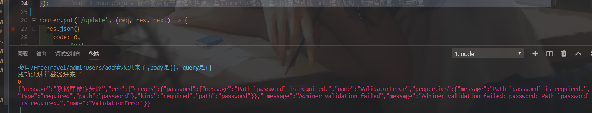

<!--
 * @Description: 
 * @version: 
 * @Author: lxw
 * @Date: 2020-05-12 11:06:40
 * @LastEditors: lxw
 * @LastEditTime: 2020-06-05 12:04:50
 -->

##### 局域网接口baseurl
http://192.168.31.8/FreeTravel

##### 使用express框架搭建的纯web api接口，接口风格是resful api风格
##### 特点
1. 架构设计，实现resfule api接口设计、项目分层结构设计，解耦业务逻辑代码，提高代码的可维护性
2. 一套接口可用于多端客户端，pc端管理系统、移动端app，安卓、ios
3. 基于nodejs的npm插件系统配置一套脚手架基础设施，实现自动化工程开发，包括
4. 从0搭建mvc框架模式，从数据库配置、路由配置、业务逻辑流程组织
5. 使用webpack作为项目自动构建工具，配置一个最基础的自动化工程开发脚手架设施，未使用express官方提供的cli。
```
1. node开发过程中自动重启服务器，无需每次都要运行node index.js启动服务器（nodemon)
2. 使用ES6，ES7 编写代码，自动编译 使用import，export新特性。(babel)
3. 项目环境变量配置，这里环境变量是为了自动区分开发环境和生产环境
4. 自动化单元测试
5. 自动部署到远程服务器
```
4. 基于express框架的特点
   - 中间件，拦截实现(登录权限、接口权限、以及其他安全性拦截比如资源的防盗链接的实现，也是基于中间件来实现的，配置一个中间件回调函数，通过req.get获取hot进行判断。一般是用于资源比如图片、视频链接的防盗处理，比如这里有一张用户上传的图片。。。。。)，其他功能插件实现比如解析post请求、解析cookie字段，session
   - 路由
5. 基于mongoose特点
   - mongoose连接数据库配置
   - mongoose创建model，实现数据库增删改查


##### 基础设施问题
-  babel解析es6
> 问题一，在babel import模块中存在async特性，babel-core无法解析需要安装一个扩展包babel-profill[link](https://www.babeljs.cn/docs/babel-polyfill)
> [参考](https://www.cnblogs.com/Jeely/p/11231530.html)
```
1.打开命令行键入 npm install --save-dev babel-polyfill 安装polyfill

2.在webpack.config.js中最上面写上var babelpolyfill = require("babel-polyfill");

3.在自己的项目js文件中最开头写上import "babel-polyfill";

然后在.babelrc文件中配置preset-envc插件中的参数"useBuiltIns":"usage"，让babel按需引入需要的补充模块：
{
    "presets":[
        ["@babel/preset-env",{
            "useBuiltIns":"usage"
        }],
        "@babel/preset-react"
    ]
}
```
4. swagger-ui配置接口文档

- 控制条调试问题
1. 打印问题
> 封装一个全局的consoleLog，打印彩色字体。
   - 方案一、自己封装，这里是我自己封装了一个[link](https://blog.csdn.net/autumn84/article/details/44816947?utm_medium=distribute.pc_relevant.none-task-blog-BlogCommendFromMachineLearnPai2-2.nonecase&depth_1-utm_source=distribute.pc_relevant.none-task-blog-BlogCommendFromMachineLearnPai2-2.nonecase)
   - 方案二、使用第三方插件 [link](https://blog.csdn.net/hhs57/article/details/80077568?utm_medium=distribute.pc_relevant.none-task-blog-BlogCommendFromMachineLearnPai2-4.nonecase&depth_1-utm_source=distribute.pc_relevant.none-task-blog-BlogCommendFromMachineLearnPai2-4.nonecase)


##### 安全性问题
1. 采用md5加密密码后存储到数据库
2. 采用session操作cookie

##### 项目运行分析
###### 入口文件
`app.js`
```
入口文件，导入express框架，使用第三方的中间件，实现一些通用操作（post请求，表单文件、session、cookie操作，安全性验证），以及自定义拦截器中间件实现对路由的全局拦截，启动路由模块，导入调用封装的业务路由的控制器，处理具体的路由业务逻辑，比如一个登录。。。
其他业务逻辑相关的文件夹
路由控制器，对应每一个路由请求应该进入到的方法
servicie业务逻辑层，根据控制层的路由请求信息，调用具体的业务层方法
数据库操作层
model层
```
优化，对于app.js使用的中间件，很多需要很多配置代码，如果都写在一个js文件里面会过于庞大，所以可以建立相关的目录封装后再在app.js里面引入

##### 静态资源托管
[link](https://www.expressjs.com.cn/starter/static-files.html)

##### 项目开发相关参考文章、网站
[express集成swagger](https://www.jianshu.com/p/e7c7e7b1d858)
[swagger注释编辑器](http://editor.swagger.io/#)
[nodejs 使用swagger ui的正确方式](https://www.jianshu.com/p/2b1db8bff5a1)
[respon返回数据格式和返回方式](https://blog.csdn.net/qq_41761591/article/details/86467827?utm_medium=distribute.pc_relevant.none-task-blog-BlogCommendFromMachineLearnPai2-1.nonecase&depth_1-utm_source=distribute.pc_relevant.none-task-blog-BlogCommendFromMachineLearnPai2-1.nonecase)
【babel](https://blog.csdn.net/houdabiao/article/details/78620202)
[使用中间件和获取请求的host实现防盗连接]()
[mongoose常用操作文档](https://segmentfault.com/a/1190000012095054)
[mongoose查询相关案例](https://www.cnblogs.com/coolslider/p/7832083.html)
[RESFUL架构](https://www.cnblogs.com/thinkam/p/8299452.html)


##### 业务需求相关
1. 多条件模糊查询 or函数 、and等函数

##### 一些收获
1. 模块化方法注释功能
下面的jsdoc注释模式，可以使得你的模块api在对应导入的对方使用api的时候进行提升
```js
 /**
   * 使用 Model save() 往数据库管理员集合添加一个document。
   *
   * @param obj 构造实体的对象
   * @returns {Promise}
   */
```

2. 错误处理相关
> 几个涉及到io操作、网络请求的地方
  - 数据库连接
  - 使用mongosse model操作数据库
  - 网球请求，路由拦截，对应路由回调函数
> 异步实现，事件，回调
> 错误处理的话，进行捕获，暴露错误
> 项目中的错误处理逻辑，以路由进来，调用service层，再调用Dao层操作数据库为例
```
1. 在Dao层，是实际操作数据库代码，属于io操作，使用async实现异步io
2. Dao层处理不进行错误捕获
3. 在serve调用Dao层方法，使用Promise实现异步，以及捕获Dao层可能出现的错误，捕获之后暴露给路由层也就是controler层
4. controle层接受到错误，使用res将封装的错误信息发送给前端，以及使用封装的console打印到控制台。
```


3. 静态资源打包的额外考虑，比如我项目src通过bable解析后存放在dist目录的，它是解析js文件的，但是如果存在其他的文件比如静态文件，这里我发现静态文件如果不喷子和
忽略的话，它会解析，但是只解析里面的js文件，其他的地方都没有了，所以才说需要webpack这样的全功能的构建工具
4. express static解析静态资源路径问题
```js
    app.use('/swagger-ui',express.static(path.join(__dirname,'./public/swagger-ui')))

```

5. 与数据库交互的方式
> 1. 使用数据库的自带的查询语言（比如sql）
> 2. 使用对象模型('ODM')或对象关系模型("ORM")，一个ODM或ORM对象代表的就是一个映射到底层数据库的数据对象比如json对象。一些ORM对象是指定数据库的，一些则不然。
> 使用ODM的优势在于程序员可以一直关注与JavaScript 对象而不是数据库语义，尤其> 是在你需要和不同的数据库交互（可能是同一应用，或不同应用）。ODM也提供了清晰> 方式去校验检查数据。
> 使用ODM或ORM可以降低开发和维护成本，除非你非常擅长原生查询语言，或对性能要求很高，否则你都应该优先考虑使用ODM或ORM。

> 在选择解决方案时一般应该考虑他们都提供哪些功能，以及他们社区的活跃度（下载，捐款，Bug报告，文档质量）。在此文写作时Mongoose当前最受欢迎的ORM，如果你在你的应用中使用MongoDB作为你的数据库，那么他是一个合理的选择。

6. mongosse基础到高级使用增删改查
> mongosse是一个用于异步环境的MongoDB的对象模型

6. 使用express搭建restful风格api的可能性：路由支持动态路径，也就是动态路由，基于动态路由设计restful风格的接口[link](https://www.cnblogs.com/thinkam/p/8299452.html)
```js
/* patch users */
router.patch('/:id', function (req, res) {
    console.log('patch users called');
    userDAO.getById(req.params.id, function (user) {
        var username = req.body.username;
        if(username) {
            user.username = username;
        }
        var password = req.body.password;
        if(password) {
            user.password = password;
        }
        console.log(user);
        userDAO.update(user, function (success) {
            var r =  result.createResult(success, null);
            res.json(r);
        });
    });
});
````
7. mongosse多id查询[link](https://blog.csdn.net/weixin_33810006/article/details/86260682)
```js
传入多个id，查询多条数据，传入id数组，使用$in方法

Model.find({ _id: { $in: ['aID', 'bID'] } });
```
比如是一个角色里面有一个数组保存了多个权限id，我想要一次性根据这些id查询所有权限

8. 非关系性数据库的另一个好处，对比mysql，mysql表设计好了，每个记录的结构都是固定好的，如果后期有表的记录需要添加一个新的字段，你必须修改表的结构，但是
对于mongodb的话，表字段是文档是类似json对象文档，这使得每个集合的结构不用严格对应，比如一个集合多一个字段，另一个集合少一个字段，比如一个表结构里面有a、b、c三个字段如果是这个表维护不同的用户，一开始它们拥有的字段都是三个是一致的，但是如果后期需求变更了，它们是有很大相似性的，角色a用户需要字段abcd，角色a只需要ab，角色d需要a字段，次数你的表就必须要设置全部字段，否在添加多字段的用户就会报错，

8.session操作步骤，记住session依附于requset，记住这一点就可以使用request.session是一个存储值的对象，可以通过类似本地缓存的操作思想
app.js
```js
//引入express-session用于在express中操作session
let session = require('express-session');
//引入connect-mongo用于session持久化
const MongoStore = require('connect-mongo')(session);

//定义一个cookie和session组合使用的配置对象
app.use(session({
    name: 'mycname',   //设置cookie的name，默认值是：connect.sid
    secret: 'atguigu', //参与加密的字符串（又称签名）
    saveUninitialized: false, //是否在存储内容之前创建会话
    resave: true,//是否在每次请求时，强制重新保存session，即使他们没有变化
    store: new MongoStore({
        url: 'mongodb://localhost:27017/cookies_container',
        touchAfter: 1800//修改频率（例：//在24小时之内只更新一次）
    }),
    cookie: {
        httpOnly: true, // 开启后前端无法通过 JS 操作cookie
        maxAge: 100 * 30 // 设置cookie的过期时间
    },
}));
```
登录成功之后
```js
  if (result) {
                    console.log(result)
                    // session操作
                    //1.在服务器中开辟一块内存，用于存储session
                    //2.将用户的id存入上一步产生的session中
                    //3.获取session的编号，放入一个cookie中
                    //4.将上一步的cookie返回给客户端
                    //以上四步可以通过一行代码搞定
                    request.session._id = result._id
                    console.log(`请求成功${result}`)
                    // 请求成功返回成功的json 状态码200
                    responResult['SUCCESS'].data = result
                    responResult['SUCCESS'].message = '登录成功'
                    resolve(responResult['SUCCESS'])
                } else {
                    responResult['NOUSER'].data = result
                    resolve(responResult['NOUSER'])
                }
```

判断是否登录
```js
 const {_id} = request.session
  if(_id){
    let result = await userModel.findOne({_id})
    if(result){
      response.render('usercenter',{nickName:result.nick_name})
    }else{
      console.log('用户非法修改了cookie')
      response.redirect('/login')
    }
  }else{
    response.redirect('/login')
  }
```
使用session的好处是更安全，更方便混淆cookie字段的key名称，这样可以阻止别人在浏览器端破解你的cooki里面的信息。客户端通过控制台来查看cookie字段，如果明文存储的话。


9. mvc模式的好处
从业务逻辑看是易于维护和扩展尤其是修改某个接口功能
1. 底层dao操作数据库是封装最基础的操作，比如一个多条件分页查询。但是不同的实体业务不同要求查询的字段和条件不同，可以在对应的service层进行具体的条件封装，dao层只提供最基础的，但是支持传参修改条件，这样方便修改和扩展新的功能，比如我这里的查询功能就是这样设计的。也就是数据库的操作与具体的业务逻辑进行分层的好处就是方便修改和扩展
```js
    /**
    * @name: 
    * @description: 分页 + 多添加模糊查询 TODO:以后这里要扩展一个字段：时间范围查询
    * @msg: 
    * @param {type} | 权限字段 |title parenttitle
    * @param {type} | 分页字段 | pageNum  pagesiez 
    * @return: 
    */
   fiindValug(title, parenttitle, pageNum, pageSize) {

    // 具体的添加规则，在这里封装比如根据title、parenttitle模糊查询，满足其中一个就可以了，注意mongoose模糊查询是利用传入正则表达式实现的
    let titleReg = new RegExp(title, 'i')
    let parenttitleReg = new RegExp(parenttitle, 'i')
    let condition = {
        $or: [
            { title: titleReg },
            { parenttitle: parenttitleReg }
        ]
    }

    let pageObj = {
        pageNum: pageNum,
        pageSize: pageSize
    }
    return new Promise((resolve, reject) => {
        pDao.findByVgue(condition, pageObj).then((result) => {
            console.log(`请求成功${result}`)
            // 请求成功返回成功的json 状态码200
            responResult['SUCCESS'].data = result
            resolve(responResult['SUCCESS'])
        }).catch((err) => {
            // 返回失败的json，状态码500
            responResult['ERROR-500'].message = '数据库操作失败'
            responResult['ERROR-500'].err = err
            reject(responResult['ERROR-500'])
        });
    });
}
````

10 多条件查询是 and or等的合并，注意哪些字段是and哪些字段是可以or的
> 一般而言状态 + 模糊字段查询的，状态和模糊字段条件是要共同成立的，也就是 状态 and 模糊字段条件

11. 文件上传相关案例
1 [link](https://zhuanlan.zhihu.com/p/92623385)：
2 [link](https://www.cnblogs.com/natsu12/p/5179991.html) :

##### 补充
1. 数据库的连接池，重复使用数据库连接
2. 登录状态判断session使用
3. 密码安全性，后台使用md5加密

TODO:有个坑，真的的记一下，dist目录才是服务器真正允许的目录。

### 简单的socke通信：nodejs socket.io使用 配合pc客户端 socket 以及flutter端websocket
目前实现可以给指定的在线用户推送消息，没有界面，没有聊天。
